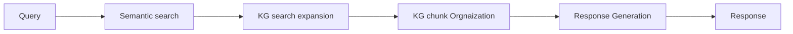

# Knowledge Graph Guided RAG Paper
- Fact level relationship between chunks. To increase the diversity and coherence in RAG result.
- KG guided chunk expansion
- increase diversity of retrieval
## code reference
- https://github.com/nju-websoft/KG2RAG

## HLD


### KG data preparation
- offline process to kg linked chunking.
- for each chunk generate (subject-relation-object) triplet through LLM.
- triplet generation sample prompt
```
Instruction:
Extract informative triplets directly from the text following the
examples. Do not add any extra words, line breaks, or spaces.
Example 1:
Text: Scott Derrickson (born July 16, 1966) is an American
director, screenwriter and producer.
Triplets:
<Scott Derrickson, born in, 1966>,
<Scott Derrickson, nationality, America>,
<Scott Derrickson, occupation, director>,
<Scott Derrickson, occupation, screenwriter>,
<Scott Derrickson, occupation, producer>
Example 2:
Text: A Kiss for Corliss is a 1949 American comedy film
directed by Richard Wallace and written by Howard Dimsdale.
Triplets:
<A Kiss for Corliss, year, 1949>,
<A Kiss for Corliss, country, America>,
<A Kiss for Corliss, genre, comedy film>,
<A Kiss for Corliss, director, Richard Wallace>,
<A Kiss for Corliss, writer, Howard Dimsdale>
```
- store chunks along with triplet

### KG enhanced chunk retrieval
1. do semantic search to find seed chunks
2. find seed triplets belonging to seed chunks
3. from seed triplets do N(1 or 2) step hopping to find kg expanded triplets
4. from kg expanded triplets add chunks to chunk sets  

### KG based context organization
1. Prefiltering step: Final KG extended graph `(chunk, List<triplets>)` Using similarity score each triplet is scored.
2. filtering step: Create separate components using Maximum spanning tree. 
   - It will remove redundant edges and chunks as same triple can occur in multiple chunks. MST will keep the maximum score chunk
   - It will remove cross edges and chunks and stores the chunks with maximum weights
3. Arranging step: integrate chunks that are closely related and provide coherent information
   - Each MST from previous steps are processed to return two representation using depth first search
     1. text representation: derived from concatenation of MSTas 
     2. triplet representation: concat tripplet in a bare minimum setence
4. score each MST using cross encoder function
5. pick the text representation from each MST by sorting MST cross encoder score in descending order.

